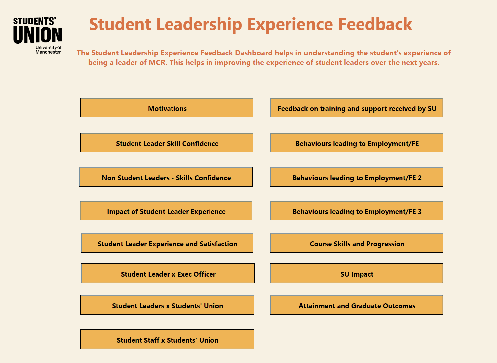
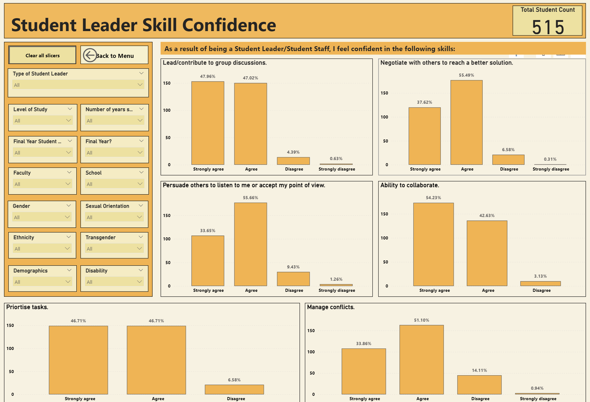
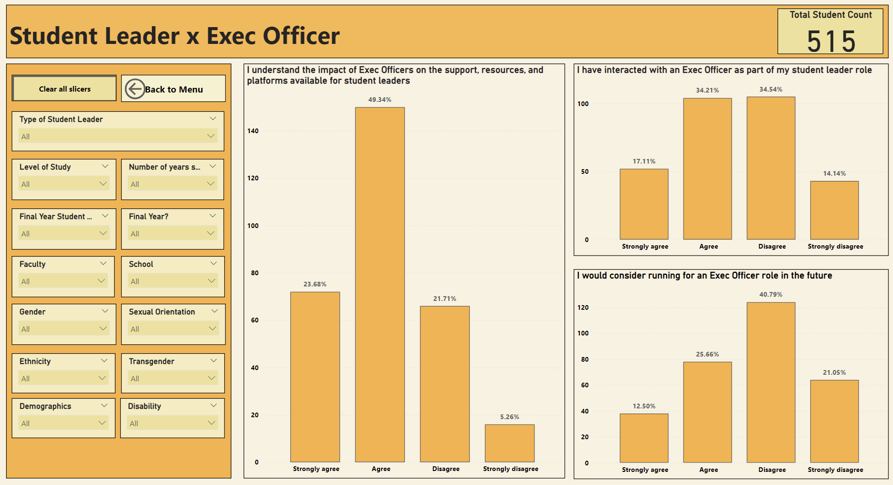

# Student Leadership Experience Feedback Dashboard

## 1. Introduction
This repository hosts the Power BI dashboard for the Student Leadership Experience Feedback at the University of Manchester. The dashboard provides insights into the experiences of student leaders, covering various aspects such as motivations, skill confidence, the impact of leadership experiences, and feedback on training and support. By analyzing this data, the dashboard aims to improve the experience and effectiveness of student leaders over the coming years.

## 2. Understanding HR requirements
The Student Leadership Experience Feedback Dashboard helps in understanding the students' experiences of being leaders at MCR. The data was collected using feedback forms with over 2000 responses from students. This comprehensive dataset helps in understanding the diverse experiences and challenges faced by student leaders and non-leaders alike.

## 3. The dashboard
### Overview
The dashboard is divided into multiple sections, each providing detailed insights into different aspects of student leadership experiences.

### Key Performance Indicators (KPIs)
At the top of the dashboard, the following KPIs are displayed to provide a quick overview:
- **Total Student Count**: The total number of students who participated in the survey. This metrics gets updated according to the filters selected.

### Filters
The dashboard includes several filters to help drill down into specific data points and personalize the data view:
- **Type of Student Leader**
- **Level of Study**
- **Number of Years as a Student Leader**
- **Final Year Student**
- **Faculty**
- **School**
- **Gender**
- **Sexual Orientation**
- **Ethnicity**
- **Transgender**
- **Demographics**
- **Disability**

### Sections
#### Motivations
This section explores the motivations behind students becoming leaders and their initial reasons for taking on leadership roles.

#### Student Leader Skill Confidence
This section assesses the confidence levels of student leaders in various skills and competencies. It covers skills such as leading group discussions, negotiating, persuading others, collaborating, prioritizing tasks, and managing conflicts.

#### Non-Student Leaders - Skills Confidence
This section compares the skill confidence levels of non-student leaders with those of student leaders.

#### Impact of Student Leader Experience
This section examines the overall impact of leadership experience on students, including personal and professional growth.

#### Student Leader Experience and Satisfaction
This section captures the satisfaction levels of student leaders with their leadership roles and experiences.

#### Feedback on Training and Support Received by SU
This section provides feedback on the training and support received by student leaders from the Students' Union.

#### Behaviours Leading to Employment/FE
This section explores the behaviors and activities of student leaders that contribute to their employability and further education opportunities.

#### Course Skills and Progression
This section looks at how leadership experiences influence course-related skills and academic progression.

#### SU Impact
This section assesses the overall impact of the Students' Union on student leaders and their experiences.

#### Attainment and Graduate Outcomes
This section examines the relationship between student leadership experiences and their attainment and graduate outcomes.

## 4. Conclusion
The Student Leadership Experience Feedback Dashboard is a valuable tool for understanding the experiences and needs of student leaders. By analyzing feedback data, the University of Manchester can make informed decisions to enhance training, support, and overall leadership experiences for students.
